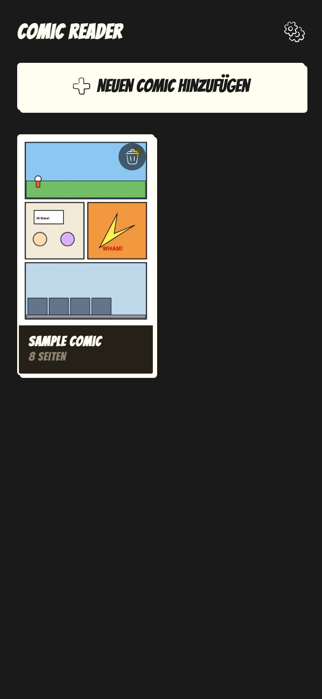
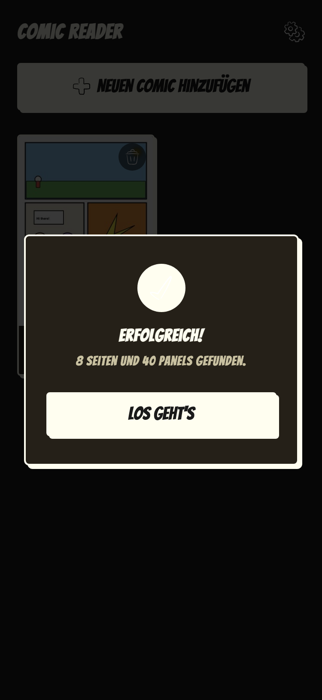
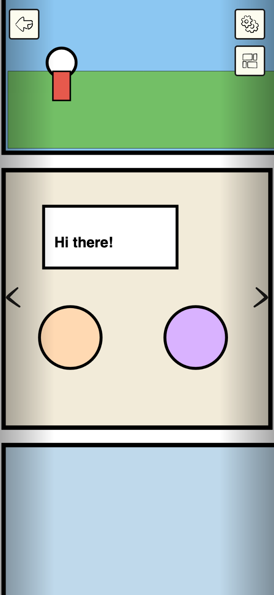
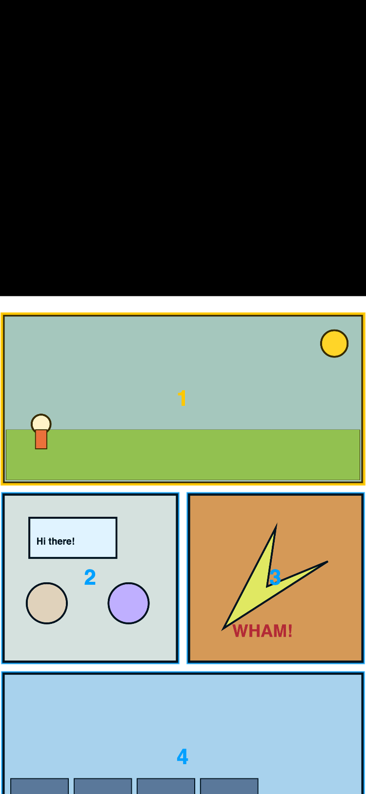

# 📖 Comic Reader

**Comics als PDF auf dem Handy lesen – ohne Zoomen, ohne Scrollen.**
Die App erkennt jedes Comic-Panel automatisch und springt beim Lesen von Bild zu Bild.

### ➜ [Live ausprobieren: comic-reader.felipe-rude.de](https://comic-reader.felipe-rude.de)

*Am besten am Smartphone öffnen. Kein Comic zur Hand? Einfach das [Beispiel-Comic (PDF)](docs/sample-comic.pdf) herunterladen und importieren.*

---

## Was macht die App?

PDF-Comics auf dem Smartphone sind frustrierend: ständig zoomen, ständig scrollen – und beim Schließen ist der Lesestand weg. Dieser Comic Reader löst das in drei Schritten:

1. **PDF importieren** – das Comic wird komplett lokal im Browser gespeichert (IndexedDB)
2. **Automatische Panel-Erkennung** – ein selbst entwickelter Algorithmus analysiert jede Seite und findet die einzelnen Panels
3. **Smart-Zoom-Lesen** – ein Tap, und die Kamera fährt zum nächsten Panel. Der Lesestand wird bei jedem Schritt gespeichert

Alles läuft im Browser: **kein Backend, kein Account, 100 % offline** – installierbar als PWA auf iOS und Android.

## Screenshots

| Bibliothek | Panel-Analyse | Smart-Zoom | Erkannte Panels (Debug) |
|:---:|:---:|:---:|:---:|
|  |  |  |  |

## Features

- 📚 **Lokale Bibliothek** – Comics importieren, Cover-Vorschau, löschen, Speicher verwalten
- 🔍 **Panel-Erkennung ohne schwere Libraries** – kein OpenCV: ein eigener Vanilla-JS-Algorithmus scannt die Seiten per Canvas-Pixeldaten nach Weißräumen (Gutter-Analyse) und berechnet daraus die Panel-Rechtecke
- 🎯 **Smart-Zoom** – die volle Seite bleibt gerendert, nur der CSS-Viewport (`translate` + `scale`) fährt animiert von Panel zu Panel
- 🤏 **Pinch-to-Zoom-Fallback** – jederzeit manuell zoomen und verschieben, danach übernimmt wieder der Smart-Zoom
- 💾 **Lesestand-Speicherung** – die App merkt sich Seite und Panel und springt beim nächsten Öffnen genau dorthin zurück
- 🧠 **RAM-schonend** – auch große PDFs (200 MB+) werden Seite für Seite analysiert, Ergebnisse landen sofort in der IndexedDB
- 🌗 **Light & Dark Mode** – folgt automatisch der Systemeinstellung
- 📱 **PWA** – installierbar auf dem Homescreen, komplett offline nutzbar

## Technik

| Bereich | Technologie |
|---|---|
| Framework | Vue 3 (Composition API) + Vite |
| PDF-Rendering | PDF.js (Mozilla) |
| Panel-Erkennung | Eigener Algorithmus (Canvas `getImageData`, Projection-Profile) |
| Speicherung | IndexedDB via `idb` |
| Styling | Custom SCSS – bewusst **ohne** UI-Framework |
| Offline / PWA | Service Worker via `vite-plugin-pwa` |

## Lokal starten

```bash
npm install
npm run dev
```

Dann `http://localhost:5173` öffnen und ein Comic-PDF importieren – zum Testen liegt ein [Beispiel-Comic](docs/sample-comic.pdf) im Repo.
